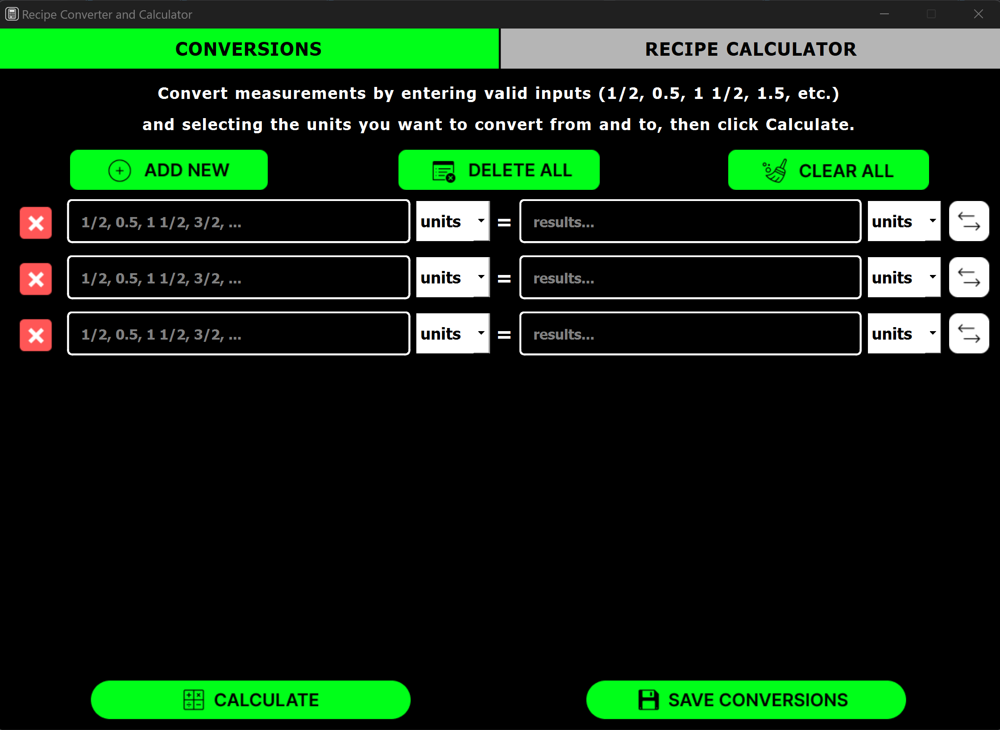
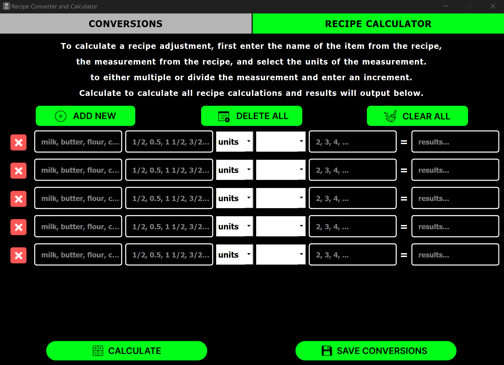

# Recipe Calculator and Converter
This project was created as the portfolio project for CS361 (Software Engineering I) at Oregon State University. 
The project is a Recipe Calculator and Converter desktop application. It is written in python and uses PySide6 and PyQT 5 for the UI. The app utilizes microservice architecture. Users input values into the UI and then the client-side request is sent to the server in order to receive back the desired data (the response). This client/server interaction is handled using ZeroMQ. The development of the project followed a typical Agile development cycle with a focus on fulfilling user stories and inclusivity heuristics.

### Languages Used
<ul>
    <li>Python</li>
</ul>

### Technologies and Libraries Used
<ul>
    <li>ZeroMQ for client/server communications for microservices</li>
    <li>PySide 6 for UI</li>
    <li>PyQT 5 integrated with PySide for UI</li>
</ul>

## Conversions
The Conversions tab takes user input to convert measurements for each entered value. Users can add multiple entries, delete an entry, delete all entries, clear all current inputs in the entries, and export the entries and results.

To use this, the user should input a valid value for the quantity to convert, select the input units, and then select the desired output units. Once all entries are filled, click the Calculate button to see the output result(s) of the conversion(s). If a required field is missing or if the input is not valid, the user will be notified. 

## Recipe Calculator
The Recipe Calculator tab takes user input to change quantities for recipe values to change serving sizes. Similarly to the Conversions tab, users can add multiple entries, delete an entry, delete all entries, clear all current inputs in the entries, and export the entries and results.

To use this, the user should input the name of the recipe component, the quantity/value of that component, the measurement unit, choose to increase or decrease the value, and then input the value to multiply or divide the recipe quantity by. Once all entries are filled, click the Calculate button to see the output result(s) of the conversion(s). If a required field is missing or if the input is not valid, the user will be notified.

